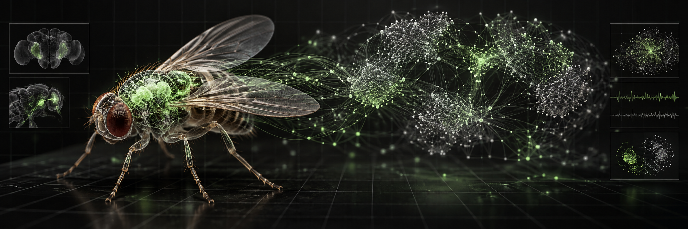

# MOSCA.QUANT

### Coloquei 668 neurônios reais diante do Bitcoin.

**MOSCA.QUANT** é um laboratório interativo de Data Science. Candles públicos de BTC-USD são convertidos em seis sinais sensoriais, propagados por um subconjunto real do conectoma da *Drosophila melanogaster* e decodificados como **BUY**, **HOLD** ou **SELL**.

Não há dinheiro real, conta conectada ou execução de ordens. A carteira é simulada e todas as decisões podem ser exportadas.

> Pergunta do experimento: **um circuito limitado pela conectividade real consegue superar um benchmark simples de buy & hold?**

## Fluxo

    Candles OHLCV públicos
            │
            ▼
    retorno · momentum · volatilidade · volume · drawdown · range
            │
            ▼
    LC4 / LPLC2 ──► grafo FlyWire FAFB v783 ──► neurônios descendentes
                                                            │
                                                            ▼
                                                   BUY / HOLD / SELL
                                                            │
                                                            ▼
                                        paper portfolio + benchmark + CSV

## O que você pode testar

- Rodar um replay de 180 candles horários.
- Alternar entre **Conectoma**, **Momentum** e **Aleatório**.
- Acompanhar equity, retorno, alpha, Sharpe, drawdown e taxa de acerto.
- Ver os disparos sobre as 18.968 conexões em tempo real.
- Auditar o motivo e a execução de cada proposta.
- Exportar candles, features, decisões e métricas para CSV.
- Manter plasticidade experimental entre sessões no localStorage.
- Copiar o resultado já formatado para LinkedIn.
- Gerar um vídeo vertical **4:5, 1080 × 1350, 30 FPS e 15 segundos** com a mosca operando, decisões, atividade neural e resultado.

## Vídeo para LinkedIn

Clique em **Gerar vídeo 4:5** no scoreboard. O estúdio abre uma prévia e, ao clicar em **Gravar e baixar vídeo**, executa um replay novo com o controlador Conectoma e baixa `mosca-quant-linkedin-AAAA-MM-DD.webm`.

O roteiro é automático:

1. gancho com os 668 neurônios reais;
2. candles, conectoma e mosca operando o terminal;
3. resultado contra buy & hold;
4. chamada para o código e aviso de paper trading.

A gravação usa `canvas.captureStream()` e `MediaRecorder`. Ela acontece localmente no Chrome ou Edge, sem upload e sem dependências externas.

## Dados reais

### Conectoma

O circuito deriva do **FlyWire FAFB v783** e contém 668 neurônios e 18.968 conexões dirigidas. Entre as populações selecionadas estão LC4, LPLC2, Giant Fiber, DNa01, DNa02, DNp09 e MDN.

Cada neurônio mantém root_id, tipo, lado e posição. Cada aresta mantém origem, destino e quantidade de contatos sinápticos com sinal derivado da previsão de neurotransmissor.

### Mercado

O navegador consulta o endpoint público de candles da Coinbase Exchange para BTC-USD em granularidade de uma hora. A API não exige credenciais. Caso a fonte esteja indisponível, a interface usa uma série determinística de fallback e a identifica explicitamente.

Nenhum preço, posição ou dado de conta privado é acessado.

## Medido versus modelado

| Camada | Origem |
| --- | --- |
| IDs, tipos, posições e conectividade | Medidos no FlyWire |
| Direção e contatos sinápticos | Medidos no FlyWire |
| Sinal excitatório/inibitório | Inferido pelo neurotransmissor previsto |
| Candles OHLCV | API pública da Coinbase |
| Feature engineering | Modelado neste projeto |
| Correntes sensoriais e dinâmica LIF | Modeladas |
| Decoder BUY/HOLD/SELL | Modelado e fixo |
| Plasticidade por recompensa | Modelada |
| Carteira, fees e risk guard | Simulados |

O projeto não demonstra que uma mosca entende mercados, aprende uma estratégia lucrativa ou reproduz comportamento biológico.

## Protocolo

- Capital inicial: **US$ 10.000 simulados**.
- Exposição máxima: **70%**, sem shorts ou alavancagem.
- Fee simulada: **0,15%** por operação.
- Benchmark: **70% buy & hold + 30% caixa**.
- Janela: **180 candles de 1 hora**.
- Baselines: regra de momentum e política aleatória.
- Métricas: retorno, alpha, Sharpe não anualizado, maximum drawdown, trades e hit rate.

Resultados isolados não sustentam uma conclusão. Uma avaliação séria exige múltiplas janelas cronológicas, sementes independentes, custos realistas e análise fora da amostra.

## Executar

    python -m http.server 8080

Abra [http://localhost:8080](http://localhost:8080).

## Testar

    node --check app.js
    node tests/connectome.test.js

## Fontes

- Dorkenwald, S. et al. [Neuronal wiring diagram of an adult brain](https://doi.org/10.1038/s41586-024-07558-y). *Nature* 634, 124–138 (2024).
- Schlegel, P. et al. [Whole-brain annotation and multi-connectome cell typing of Drosophila](https://doi.org/10.1038/s41586-024-07686-5). *Nature* 634, 139–152 (2024).
- [Coinbase Exchange — Get product candles](https://docs.cdp.coinbase.com/api-reference/exchange-api/rest-api/products/get-product-candles).

## Licenças

O código está sob MIT. O subconjunto FlyWire permanece sob **CC BY-NC 4.0**, com atribuição obrigatória e uso não comercial. Consulte [data/DATA_LICENSE.md](data/DATA_LICENSE.md).

## Autor

**Matheus Santos** — Data Scientist | Data Analyst  
[GitHub @Matheussantos25](https://github.com/Matheussantos25)
